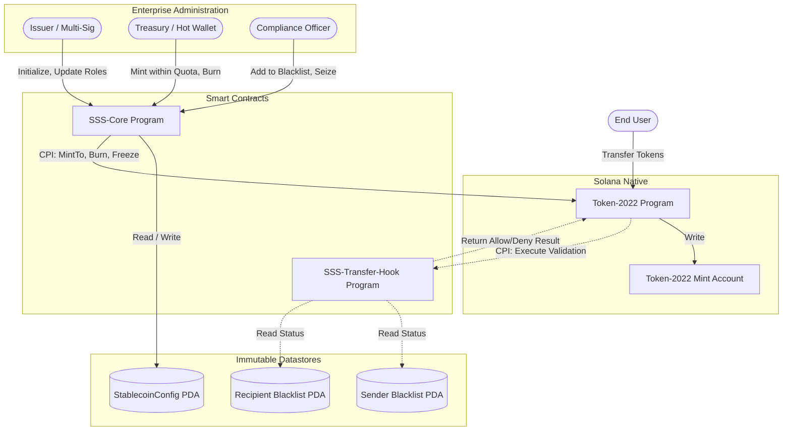

# Solana Stablecoin Standard (SSS) Architecture

This document describes the high-level architecture of the Solana Stablecoin Standard (SSS), designed for technical implementers and enterprise stakeholders.

## Overview

The SSS is built using the **Solana Token-2022** standard. This provides a rich set of built-in extensions to handle advanced tokenomics and compliance requirements natively on-chain, avoiding the risks of heavily customized or fragmented smart contracts.

By relying on Solana's core audited deployments, the SSS guarantees maximum security, composability within DeFi, and throughput efficiency.

The project is split into two primary Anchor programs:

1. **sss-core**: The main program that serves as the administrative controller and state manager for stablecoins. It handles issuance (minting), redemption (burning), role management, and triggering legal/compliance actions.
2. **sss-transfer-hook**: An optional but critical compliance engine for SSS-2 (Regulated) tokens. It enforces pre-transfer logic, acting as an invisible firewall validating sender and recipient addresses against on-chain blacklists before allowing any token transfer to settle.

## Core Components

### 1. `sss-core` Program

The core program revolves around several PDA-based (Program Derived Address) state accounts which store unalterable, cryptographically secure data:

*   **`StablecoinConfig` PDA**: The global source of truth. It stores the stablecoin's meta-information, role assignments (who can do what), feature toggles (e.g., `enable_transfer_hook`), and tracks macroeconomic aggregate states like total supply. It owns the cryptographic `MintAuthority`.
*   **`MinterConfig` PDA**: Used to manage individual minters (e.g., specific banking partners or corporate treasuries). It enforces algorithmic minting limits (quotas) per day/week so compromised hot wallets cannot hyper-inflate the supply.
*   **`BlacklistEntry` & `SeizureRecord` PDAs**: Immutable audit trails. These accounts permanently log who was sanctioned, why, and what assets were seized under court order.

### 2. `sss-transfer-hook` Program

This program intercepts every single peer-to-peer transaction on the network.

*   **How it works**: When a transfer is initiated by any user on any platform, the Token-2022 program automatically asks `sss-transfer-hook` for permission *before* moving any funds.
*   **Validation**: The hook derives the identities of the sender and recipient, then cross-references them against the `BlacklistEntry` registries. If an active match is found, the transaction is immediately blocked and an event is emitted for off-chain alerting.

## Component Interaction Diagram

## Security & Governance Posture

*   **No Direct Mint Authority**: Nobody holds the raw private key for the Mint. The `StablecoinConfig` smart contract is the sole Mint authority. Therefore, all minting must flow through the contract, strictly enforcing the algorithmic quotas and emergency pause rules mathematically.
*   **Two-Step Authority Handover**: To prevent fat-finger mistakes causing the accidental loss of the entire stablecoin configuration, transferring the "God Mode" `master_authority` requires a `propose` transaction by the current owner and an explicit `accept` transaction by the receiver.
*   **Cryptographic Derivations**: The transfer hook mathematically guarantees that the blacklist databases it queries are authentically signed by the `sss-core` program, preventing spoofed hacker accounts from bypassing corporate compliance checks.
