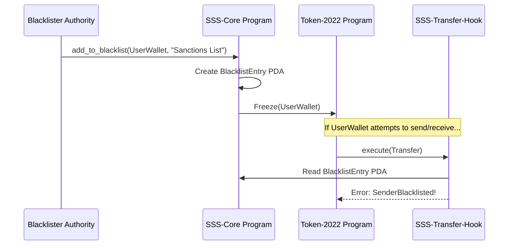
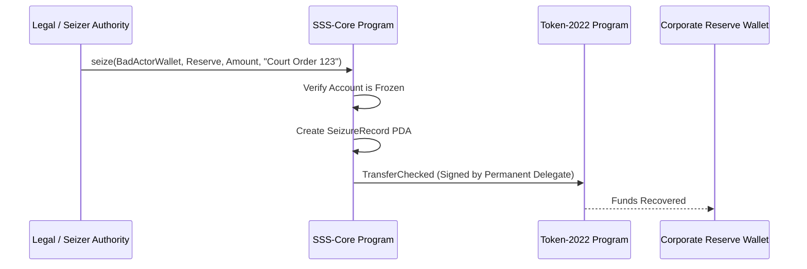

# Compliance and Regulation (SSS-2)

The `SSS-2: Regulated` preset is designed for stablecoins that require strict adherence to regulatory frameworks, such as AML (Anti-Money Laundering) and KYC (Know Your Customer) policies.

To achieve this, SSS-2 leverages advanced Token-2022 extensions to enforce compliance natively on the Solana blockchain.

## Stakeholder Overview

For compliance officers, legal teams, and risk managers, the SSS-2 protocol ensures that:
1. **No unauthorized transactions occur**: Every transfer is intercepted and validated against a real-time on-chain blacklist.
2. **Assets are recoverable**: In the event of a hack, court order, or lost keys, authorized administrators can recover funds.
3. **Roles are securely separated**: Technical teams cannot unilaterally perform compliance enforcements without the specialized compliance keys.

## Core Compliance Features

### 1. Unified On-Chain Blacklisting

The SSS architecture implements a robust, unified blacklisting system.

*   **How it works:** A designated `blacklister` authority can call the `add_to_blacklist` instruction on the `sss-core` program. This simultaneously:
    1.  Creates a `BlacklistEntry` PDA containing the address and the reason for blacklisting.
    2.  Performs a CPI to the Token-2022 program to immediately **Freeze** the target's token account.
*   **Transfer Hook Enforcement:** The `sss-transfer-hook` program automatically checks these PDA entries during *every* transfer. If either the sender or the recipient has an active `BlacklistEntry` PDA, the transfer is rejected.
*   **Removal:** When `remove_from_blacklist` is called, the PDA is marked as `removed = true` (soft deletion) to preserve the audit trail, and the account is immediately thawed.

**Blacklist Workflow:**

### 2. Asset Seizure

In extreme regulatory scenarios (e.g., fulfilling a court order), a stablecoin issuer may need to confiscate assets from a malicious actor.

*   **Permanent Delegate:** SSS-2 utilizes the Token-2022 `PermanentDelegate` extension. During initialization, the `StablecoinConfig` PDA is set as the permanent delegate for the mint.
*   **The `seize` Instruction:** A designated `seizer` authority can execute this instruction. The `sss-core` program signs via the Config PDA (as the permanent delegate) to force-transfer tokens from a frozen account to a designated destination.
*   **Auditability:** Every seizure generates a `SeizureRecord` PDA, permanently recording the amount, source, destination, reason, and the executing authority on-chain.

**Asset Seizure Workflow:**

### 3. Default Account Freezing (Optional)

For the strictest compliance environments, an issuer might require that users pass KYC *before* they can hold or receive the stablecoin.

*   **DefaultAccountState:** SSS-2 allows enabling the `DefaultAccountState` Token-2022 extension, setting it to `Frozen`.
*   **Workflow:** Whenever an associated token account (ATA) is created for a user, it starts frozen. They cannot receive tokens until a compliance officer explicitly calls the `thaw_account` instruction on `sss-core`.

### 4. Granular Role Separation

To mitigate the risk of internal bad actors or compromised private keys, compliance capabilities are divided into specific roles:

| Role | Responsibilities | Target Persona |
| :--- | :--- | :--- |
| **Master Authority** | Upgrades roles, unpauses contract. Cannot mint or seize directly. | C-Level Executive / Multi-Sig |
| **Pauser** | Emergency role that can pause the entire stablecoin ecosystem instantly. | DevSecOps / Automated Monitor |
| **Minter** | Subject to algorithmic quotas to issue new supply. | Treasury / Hot Wallet |
| **Blacklister** | Freezes/thaws accounts and manages the blacklist registry. | Chief Compliance Officer (CCO) |
| **Seizer** | Executes forced transfers of assets from frozen accounts. | General Counsel / Legal Ops |

This separation of duties ensures that no single operational key holds complete power over the stablecoin ecosystem.
