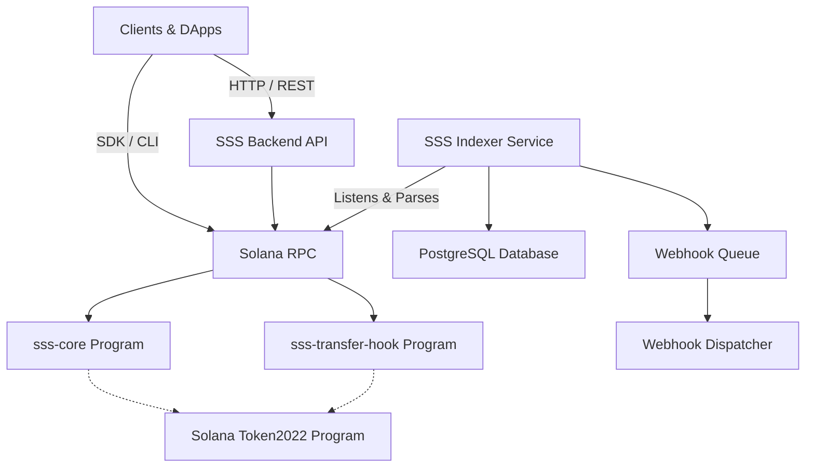

# Solana Stablecoin Standard (SSS)

## Overview

The Solana Stablecoin Standard (SSS) is a comprehensive, open-source framework designed to accelerate the deployment, management, and governance of compliant stablecoins on the Solana blockchain. SSS provides smart contracts, a powerful SDK, a REST CLI, a backend, and multiple frontend interfaces to cover the complete stablecoin lifecycle.

## Quick Start

1. **Prerequisites**
   - Node.js ≥ 18
   - Rust & Solana CLI
   - Anchor CLI

2. **Installation**
   ```bash
   git clone https://github.com/solanabr/solana-stablecoin-standard.git
   cd sss
   yarn install:each
   ```

3. **Deploy via CLI**
   ```bash
   sss-token create --name "My USD" --symbol "MUSD" --uri "https://example.com/meta.json" --preset sss2
   ```

## Preset Comparison

SSS offers intelligent presets to configure your stablecoin out-of-the-box:

| Feature | SSS-1 (Minimal) | SSS-2 (Compliant) | SSS-3 (Governance) |
|---|---|---|---|
| **Minting / Burning** | ✅ | ✅ | ✅ |
| **Pausable** | ✅ | ✅ | ✅ |
| **Freeze Accounts** | ✅ | ✅ | ✅ |
| **Blacklisting** | ❌ | ✅ | ✅ |
| **Token Seizure** | ❌ | ✅ | ✅ |
| **Transfer Hook Enforced** | ❌ | ✅ | ✅ |
| **Multi-sig / DAO** | ❌ | ❌ | ✅ |

- **SSS-1**: A lightweight but fully functional managed token. Suitable for gaming or utility tokens.
- **SSS-2**: A regulatory compliant stablecoin featuring an active blacklist and asset seizure capabilities.
- **SSS-3**: A highly-governed setup requiring native multi-sig approvals for sensitive operations and configurable time-locks.

## Architecture Diagram


